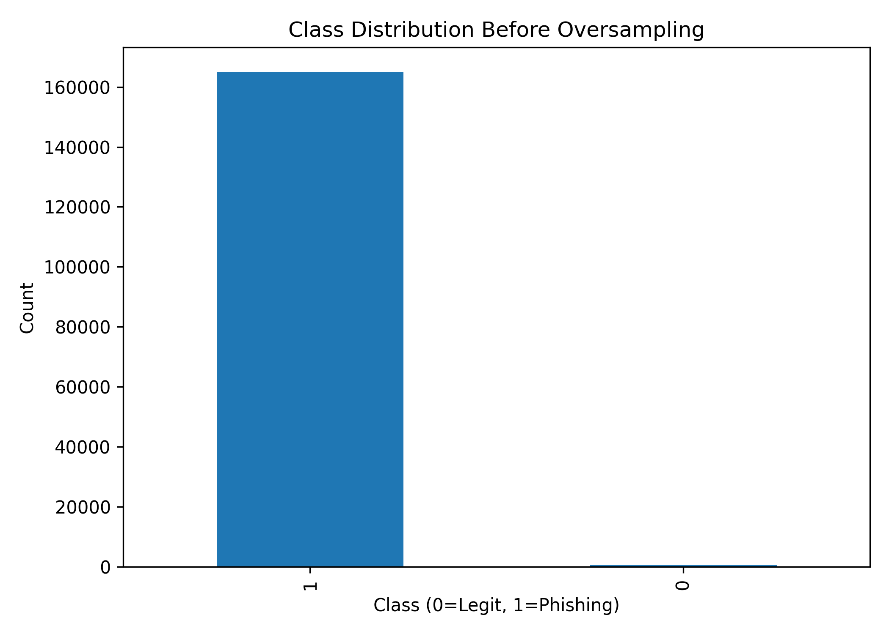
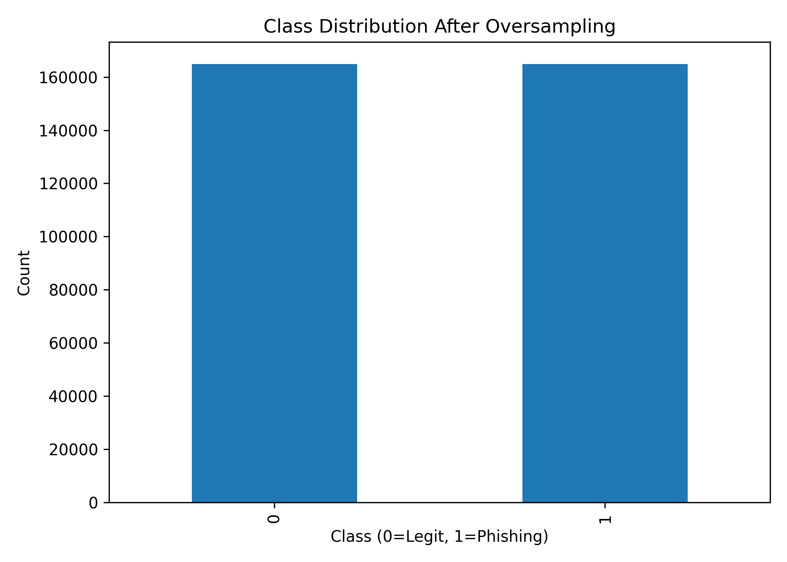

# Detecting Phishing Emails via Textual and Structural Analysis

## Overview

This project implements a machine learning–based phishing email detection system that combines Natural Language Processing (NLP) with structural email analysis to improve phishing classification accuracy.

The system analyzes both textual content and structural metadata commonly associated with phishing attacks, allowing it to better distinguish malicious emails from legitimate messages.

---

## Key Features

* TF-IDF textual feature extraction
* Structural email analysis
* URL count detection
* Subject and body length analysis
* Dataset balancing using Random Oversampling
* Logistic Regression classification model
* Automated preprocessing and evaluation pipeline
* Confusion matrix and dataset visualization generation

---

## Technologies Used

* Python
* Scikit-learn
* Pandas
* NumPy
* Matplotlib
* Natural Language Processing (NLP)
* TF-IDF Vectorization
* Logistic Regression

---

## Project Structure

```bash
Project_3/
│
├── data/
│   ├── emails_cleaned.csv
│   ├── ham_clean.csv
│   └── phishing_clean.csv
│
├── graphs/
│   ├── class_distribution_before.png
│   ├── class_distribution_after.png
│   └── confusion_matrix.png
│
├── models/
│   ├── phishing_detector_v3.pkl
│   └── vectorizer_v3.pkl
│
├── src/
│   ├── clean_merge.py
│   ├── parse_ham.py
│   ├── parse_phishing.py
│   ├── train_model.py
│   ├── train_model_with_features.py
│   └── generate_graphs.py
│
└── README.md
```

---

## Machine Learning Pipeline

1. Parse and preprocess phishing and legitimate email datasets
2. Clean and normalize textual email content
3. Extract TF-IDF textual features
4. Extract structural features:

   * URL count
   * Subject length
   * Body length
5. Balance dataset using Random Oversampling
6. Train Logistic Regression classifier
7. Evaluate performance using classification metrics and visualizations

---

## Results

### Final Model Performance

* Accuracy: **99.94%**
* High precision and recall across both classes
* Minimal false positives and false negatives

### Key Findings

* Combining textual and structural analysis significantly improved phishing detection performance
* Dataset balancing improved legitimate email recall
* Structural metadata enhanced detection of phishing attempts using realistic language patterns

---

## Visual Results

### Class Distribution Before Oversampling



### Class Distribution After Oversampling



### Confusion Matrix


---

## Skills Demonstrated

* Cybersecurity threat analysis
* Machine learning model development
* Natural language processing
* Feature engineering
* Dataset preprocessing and balancing
* Python scripting and automation
* Model evaluation and validation

---

## Documentation

Full technical report available here:

[Project Report](docs/phishing_detection_report.pdf)

---

## Future Improvements

* Real-time phishing detection deployment
* Additional structural feature extraction
* Deep learning experimentation
* API or web application integration
* Enterprise-scale dataset evaluation

