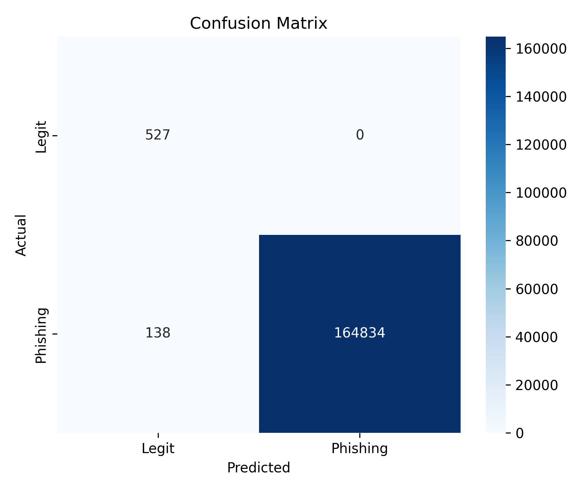

# Phishing Email Detection System

## Overview
Developed a machine learning-based phishing email detection system using textual and structural analysis.

## Technologies Used
- Python
- Scikit-learn
- TF-IDF
- Logistic Regression
- NLP

## Features
- TF-IDF textual analysis
- Structural feature extraction
- URL analysis
- Dataset balancing with oversampling

## Results
- Achieved 99.94% accuracy
- Reduced false positives
- Improved phishing detection recall

## Screenshots

